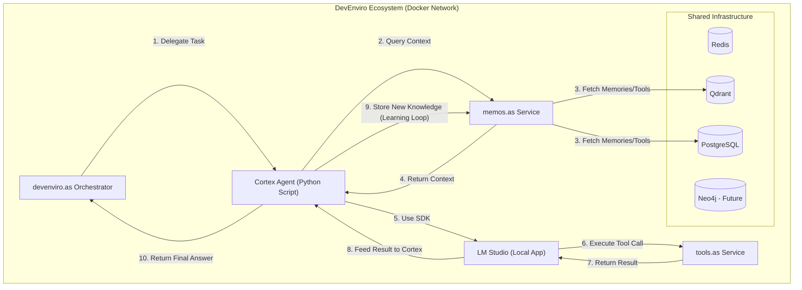

```markdown
# memOS.as: Technical Architecture

Version: 1.6

Status: Design

## 1. System Overview

memOS.as is a standalone **FastAPI microservice** that functions as the central memory and tool discovery hub for the DevEnviro ecosystem. It is designed to be a stateless service itself, with all persistence managed by the shared database infrastructure. Its primary role is to provide a unified API for agents to store experiences, discover capabilities, and ingest knowledge.

## 2. Architectural Pattern: Decoupled Service

memOS.as follows a classic microservice architecture, communicating with the devenviro.as Orchestrator and other services via a synchronous **RESTful API over HTTP**.
```

```markdown
### 3\. Core Components & Data Flow

#### Database Integration

  - **Redis (Working Memory & Cache - Tier 1):** For high-speed, short-term key-value storage and LLM caching.
  - **PostgreSQL (Procedural Memory & Registry - Tier 2):** Manages the `registered_tools` and `agent_memories` tables.
  - **Qdrant (Episodic Memory - Tier 2):** For all vector storage and semantic search operations.
  - **Neo4j (Semantic Memory - Tier 3, Future):** For managing complex relationships between system entities.

#### Knowledge Ingestion (InGest-LLM)

  - The **Cortex Agent** will operate the `ingest_indexer.py` script.
  - **Data Flow:**
    1.  The script scans a target codebase (e.g., `devenviro.as`).
    2.  It uses Python's `ast` module to extract docstrings.
    3.  It uses a local embedding model via **LM Studio** (e.g., `nomic-embed-code`) to create vectors.
    4.  It calls the `POST /memory/store` endpoint to save each docstring as a searchable memory.

### API Endpoints

The service will expose endpoints for each memory tier and capability. *(API specifications remain as previously defined.)*

## 4\. Architectural Roadmap: Phased Memory Implementation

  - **Phase 1 (Current): Episodic Memory & Tool Registry.** Focus on storing unstructured text memories in Qdrant and managing tool definitions in PostgreSQL.
  - **Phase 1.5 (Next): Working Memory & LLM Cache.** Implement the Redis-backed endpoints for high-speed, volatile memory and the LLM cache.
  - **Phase 2 (Future): Automated Knowledge Ingestion.** Develop and integrate the **InGest-LLM** service operated by the Cortex Agent.
  - **Phase 3 (Future): Semantic Memory Integration.** Integrate Neo4j to build the knowledge graph.

<!-- end list -->

``` 
 

